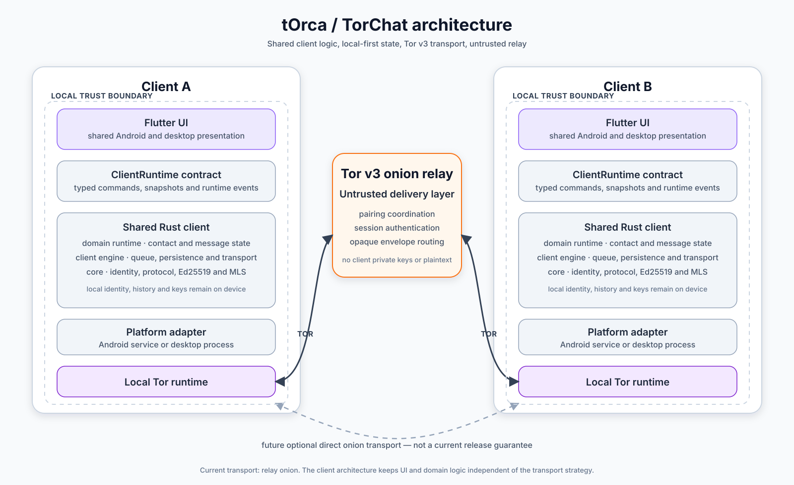
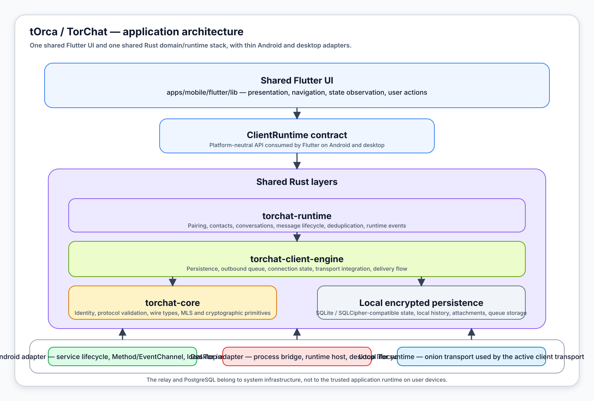

# tOrca

**tOrca** is an experimental, cross-platform, identity-minimizing private messenger built with Flutter and Rust. The application is currently presented as **TorChat** and focuses on reliable one-to-one communication over Tor v3 onion services.

The project is designed for private and pseudonymous communication without phone numbers, email addresses, public usernames or traditional user accounts. Its architecture aims to reduce linkability, metadata exposure and network-level traceability while keeping cryptographic identity and conversation data on user devices.

> [!WARNING]
> This project is under active development. Its protocol, storage format, user experience and security properties may change. It has not completed an independent security audit and should not yet be treated as production-ready software.
>
> tOrca does not claim unconditional anonymity. A compromised device, unsafe user behaviour, operating-system telemetry, implementation vulnerabilities or sufficiently capable traffic analysis may still reveal information about a user or their communication.

## Project goals

tOrca explores a local-first messenger in which:

- users create a local installation identity without an email address, phone number, password or public account;
- contacts are established through an expiring pairing code or QR code and explicit acceptance;
- message content, conversation history, private keys and MLS state remain on client devices;
- network traffic is routed through Tor v3 onion services;
- contacts do not establish ordinary direct Internet connections or disclose their public IP addresses to one another;
- an untrusted relay coordinates pairing and transports opaque encrypted envelopes;
- Android and desktop share the same Flutter interface and as much Rust client logic as possible.

The current `0.1` release focus is Windows and Android. See [RELEASE_0_1.md](RELEASE_0_1.md) for the frozen feature scope and acceptance criteria.

## Privacy model

tOrca is designed to make communication substantially more difficult to observe, correlate and attribute at the network level.

Each installation creates its own local cryptographic identity. There is no required phone number, email address, public username, central profile or public user directory. A contact relationship is created only after users exchange a short-lived pairing code or QR code and explicitly approve the connection.

Communication is routed through Tor. The current transport uses a Tor v3 onion relay, so contacts do not need to reveal their ordinary network addresses to each other. Message content is protected before it leaves the sender's trusted client boundary and is processed after it reaches the recipient's trusted client boundary.

The following data is intended to remain on client devices:

- private identity keys;
- MLS cryptographic state;
- plaintext message content;
- local contacts and aliases;
- conversation history;
- durable outbound queues;
- encrypted attachment data.

The relay is treated as untrusted infrastructure. It may authenticate sessions, coordinate pairing and forward opaque envelopes, but it must not be able to decrypt message content or access client private keys.

PostgreSQL is used only for relay control-plane state, such as temporary pairing records, session authorization, installation routing metadata and database migration state. It is not intended to be a chat-history or message-content database.

This model is intended to reduce identity exposure and metadata leakage; it is not a guarantee of perfect anonymity against compromised endpoints, global traffic analysis or vulnerabilities in the operating system, Tor network or application.

## How it works

1. Each installation creates a local cryptographic identity and connects through its local Tor runtime.
2. Users exchange a short-lived pairing code or QR code.
3. Explicit acceptance creates a trusted contact and conversation.
4. The shared Rust runtime applies pairing, contact, conversation and message lifecycle rules.
5. The shared client engine persists local state, prepares delivery and creates cryptographic envelopes.
6. The current transport sends opaque envelopes through a configured Tor v3 onion relay.
7. The recipient processes, decrypts and stores the message locally.
8. Delivery acknowledgements update the sender's local message state.

The relay is not part of the cryptographic trust boundary. It may coordinate delivery, but it must not receive client private keys or plaintext messages.

## System architecture



This diagram shows the network and trust model: two trusted clients, local Tor runtimes and an untrusted onion relay used for delivery and pairing coordination.

Trust-boundary summary:

- trusted client devices own identities, keys, MLS state and local history;
- the relay and PostgreSQL belong to untrusted infrastructure;
- opaque encrypted envelopes cross the network boundary through Tor;
- contacts do not expose ordinary direct Internet addresses to each other.

## Application architecture



This diagram shows how the application itself is organized on Android and desktop.

- **`mobile/lib`** provides the shared Flutter UI and presentation logic.
- **`ClientRuntime`** is the platform-neutral contract consumed by Flutter.
- **`common/torchat-client-runtime`** owns canonical pairing, contact, conversation and message lifecycle rules.
- **`common/torchat-client-engine`** owns persistence, outbound queues, delivery flow and transport integration.
- **`common/torchat-core`** owns identity, protocol validation, wire types and MLS-based cryptographic components.
- **platform adapters** connect the shared layers to Android services, desktop runtime hosts and local Tor lifecycle management.

Flutter is intentionally a presentation layer. Pairing transitions, contact state, message delivery state and deduplication belong to the shared Rust runtime rather than separate Android, desktop or Dart implementations.

## Repository layout

- **`mobile/lib`** — shared Flutter UI, application controller and platform-neutral `ClientRuntime` contract.
- **`common/torchat-client-runtime`** — canonical pairing, contact, conversation and message lifecycle rules.
- **`common/torchat-client-engine`** — shared client engine for persistence, queues, network state and transport integration.
- **`common/torchat-client-engine-ffi`** — C ABI boundary for native integrations.
- **`common/torchat-core`** — identity, protocol validation, wire types and MLS-based cryptographic components.
- **`mobile/android`** — Android service lifecycle, native channels, local Tor integration and encrypted persistence.
- **`desktop`** — desktop process lifecycle, local Tor integration and the Flutter runtime bridge.
- **`server/torchat-server`** — untrusted HTTP/WebSocket relay and pairing control plane.
- **`infra`** — local Tor, PostgreSQL and container infrastructure.

## Transport model

The currently implemented transport uses a configured onion relay:

```text
Client A -> local Tor -> Tor v3 onion relay -> local Tor -> Client B
```

This is not an ordinary direct Internet connection between users. Tor separates the application-level endpoints from the underlying network route, while the relay provides practical delivery and pairing coordination.

The client architecture is transport-independent. Direct device-to-device onion delivery is technically possible and may become a future transport strategy:

```text
Client A onion service -> Tor network -> Client B onion service
```

Such a design would still use Tor relays at the network layer and would introduce significant mobile lifecycle, battery, availability and offline-delivery challenges. It is therefore not a current release guarantee.

## Technology

- Flutter and Dart
- Rust
- OpenMLS and Ed25519-based identity components
- Tor v3 onion services
- WebSocket and HTTP transport
- SQLite / SQLCipher-compatible local persistence
- PostgreSQL for relay control-plane state

## Current limitations

The project is still stabilizing startup, reconnect behaviour, background lifecycle, pairing recovery, durable delivery and cross-platform release quality. Features such as calls, groups, multi-device synchronization, public discovery and cloud backup are outside the `0.1` scope.

Privacy properties also depend on correct implementation, secure endpoint devices, safe operational behaviour and the security of external components. The current experimental status must be considered when evaluating the application for sensitive use.

## Development

The repository uses a Rust workspace for shared components and a Flutter application for Android and desktop surfaces. Development and deployment commands are centralized under:

```text
scripts/torchat.ps1
```

Environment-specific onion endpoints and secrets must not be committed.

## License

The Rust workspace is licensed under **AGPL-3.0-or-later**.
